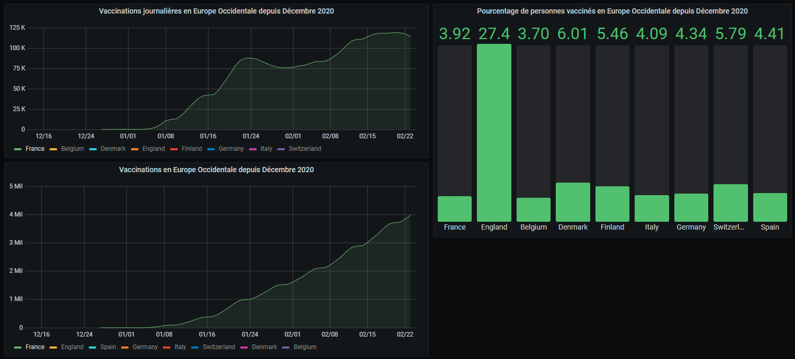

# Docker_Grafana_MySQL

Ce dashboard a été réalisé grâce à Docker avec des conteneurs Grafana et MySQL afin de permettre une visualisation graphique des données mondiales de vaccinations de la Covid 19 depuis Décembre 2020.

## Installations

* `Docker Desktop` pour la création de nos containeurs. Suivre ce [lien](https://www.docker.com/products/docker-desktop) pour l'installation. 

* Une fois le téléchargement terminé, télécharger les images de Grafana et MySQL. Pour cela, réaliser les commandes suivante dans le terminal :

    * `docker pull grafana/grafana`
    * `docker pull mysql/mysql-server:5.4`
    

## Création du répertoire :

 - /Docker_Grafana_MySQL
 
       - /dashboards`
       
             - dashboard.json
             
             - default.yml
             
       - /datasources
       
             - default.yml
             
       - country_vaccination.sql
       
       - country_vaccinations.csv
       
       - docker-compose.yml

## Création du Docker-compose :

Afin de pouvoir définir et lancer une application qui fonctionne avec plusieurs conteneurs, nous utilisons l'outil Docker-compose. Pour ce cela, créer le fichier `docker-compose.yml`. 

### Mysql :

Afin de pouvoir charger notre base de donnée sur la vaccination à la création et au lancement du conteneur nous devons définir le volume suivant :

* `- ./country_vaccination.sql:/docker-entrypoint-initdb.d/init.sql`

Nous chargons notre base de donnée `country_vaccination.sql` de notre repertoire dans celui du conteneur `/docker-entrypoint-initdb.d/init.sql`.

Nous définissons également nos identifiants de connexion avec les variables d'environnements suivantes :

* `MYSQL_ROOT_PASSWORD: eureden`
* `MYSQL_DATABASE: vaccinations`
* `MYSQL_USER: root`
* `MYSQL_PASSWORD: eureden`

### Grafana :

Le conteneur Grafana contient un dossier `provisionning` dans lequel nous pouvons initier la connection à notre base de donnée et le chargement de graphe à la création du conteneur.

#### Connexion à la base :

Définir le volume suivant : `- ./datasources:/etc/grafana/provisioning/datasources/`

Le dossier `datasoucres` contient le fichier `default.yml` qui dénit les paramètres de connexion.

#### Chargement des graphes :

Définir le volume suivant : `- ./dashboards:/etc/grafana/provisioning/dashboards/`

Le dossier `dashboards` contient le fichier de configuration `default.yml` ainsi que les graphes sous format `.json` : `dashboard.json`

Définir également la variable d'environnement suivante : 
`GF_DASHBOARDS_DEFAULT_HOME_DASHBOARD_PATH: /etc/grafana/provisioning/dashboards/dashboard.json`

Les variables d'envrionnement `GF_AUTH_ORG_ROLE: viewer` et `GF_AUTH_ANONYMOUS_ENABLED: "true"` permettent d'avoir un accès visiteur sans avoir besoin d'entrer d'itendifiants.

## Création des conteneurs :

Réaliser la commande suivante au sein du répertoire local afin de construire les conteneurs : `docker-compose up -d`

## Accès au dashboard Grafana :

Pour accéder à Grafana se rendre à l'url suivante : `localhost:3000`. L'accès est en visiteur mais il est possible de se connecter avec les identifiants par défaut qui sont:

* `user : admin`
* `password : admin`

Ici, 3 graphiques sont représentés :

